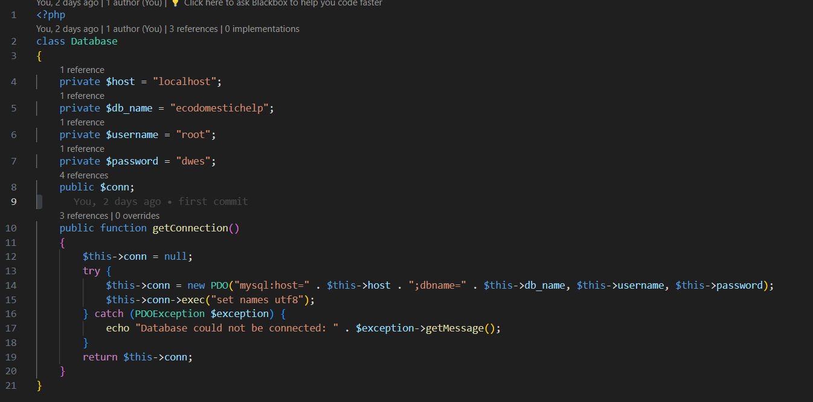
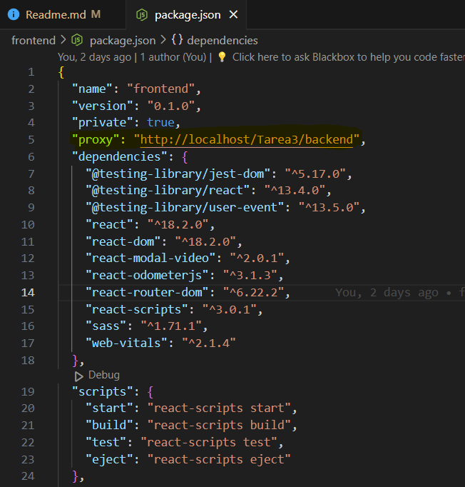

# Documentación del Proyecto

## Descripción

Este documento proporciona toda la información necesaria para configurar y ejecutar el proyecto que incluye un frontend en React, un backend en PHP y una base de datos MySQL, utilizando XAMPP como servidor local.

## Prerrequisitos

Antes de iniciar, asegúrate de tener instalado:

- **XAMPP**: Para el servidor local y la base de datos MySQL.
- **Node.js y npm**: Necesarios para ejecutar el proyecto React.
- **PHP y Composer**: Para gestionar las dependencias del backend.

## Configuración del Backend

### 1. Preparación del entorno

Coloca la carpeta `Tarea3` dentro del directorio `htdocs` de XAMPP.

### 2. Configuración de la base de datos

- **Crear la base de datos**: Utiliza el script proporcionado en `scripts creacion de base de datos.sql` dentro de la carpeta `Tarea3`.
- **Configuración de conexión**: Modifica las credenciales de conexión en el archivo `database.php` que se encuentra en el directorio `config`.

## Configuración del Frontend

1. **Navegación al directorio del frontend**:
   cd C:\xampp\htdocs\Tarea3\frontend

2. **Instalación de dependencias**:
   npm install

3. **Configuración del proxy**:
   Añade un proxy al package.json en frontend para reenviar las peticiones API a PHP:
   "proxy": "http://localhost/Tarea3/backend",
   

## Ejecución del Proyecto

Para ejecutar el frontend, utiliza el siguiente comando en el directorio del frontend:
npm start

Si encuentras problemas con versiones más recientes de Node.js, intenta ejecutar:
$env:NODE_OPTIONS="--openssl-legacy-provider"

La aplicación se abrirá automáticamente en http://localhost:3000 en tu navegador predeterminado.

Este README debe proporcionar una guía clara para configurar y ejecutar el proyecto sin problemas.
