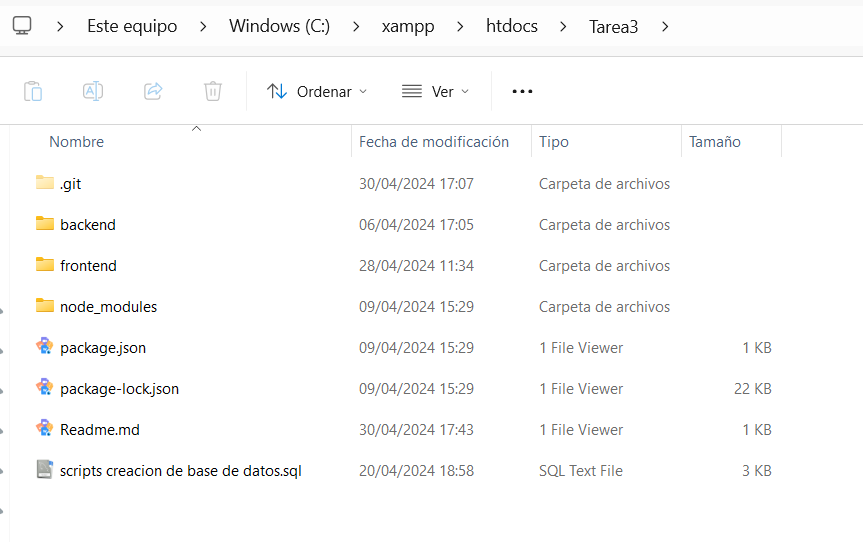

Documentación

Esta guía asistirá en la configuración y ejecución del proyecto, que consta de un frontend en React, un backend en PHP y una base de datos MySQL, todo sobre un servidor XAMPP.

Prerrequisitos
XAMPP, Node.js and npm, php and Composer.

Configuración del Backend
1.Coloca la carpeta Tarea3 en htdocs de XAMPP

1.Database Connection:
